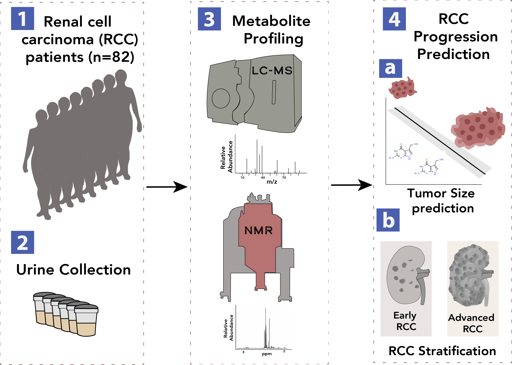

Repo for submitted paper (Bifarin _et al_ 2021 Cancers)

# Urine-Based Metabolomics and Machine Learning Reveals Metabolites Associated with Renal Cell Carcinoma Progression

**Simple Summary**: Every year, hundreds of thousands of cases of renal carcinoma (RCC) are reported worldwide. Accurate staging of the disease is important for treatment and prognosis purposes, however contemporary methods such as computerized tomography (CT) and biopsies are expensive and prone to sampling errors, respectively. As such, a non-invasive diagnostic assay for staging would be beneficial. The aim of this study is to investigate urine metabolites as potential biomarkers in staging RCC. In the study, we identified a panel of such urine metabolites with the aid of machine learning techniques.

**Abstract**: Urine metabolomics profiling is an excellent non-invasive tool for staging RCC, in addition to providing metabolic insights into the disease progression. In this study, we utilized liquid chromatography-mass spectrometry (LC-MS), nuclear magnetic resonance (NMR), and machine learning (ML) for the discovery of urine metabolites associated with RCC progression. Two machine learning problems were posed in the study: RCC tumor size prediction, and binary classification into early RCC (stage I and II) and advanced RCC stages (stage III and IV). 82 RCC patients with tumor size and metabolomic measurements were used for the regression task, and 70 RCC patients with complete tumor-nodes-metastasis (TNM) staging information were used for the classification tasks under ten-fold cross validation conditions. A voting ensemble regression model consisting of elastic net, ridge, and support vector regressor, predicted tumor size of RCC with a R^2 value of 0.58. While a voting classifier model consisting of random forest, support vector machines, logistic regression, and adaptive boosting gave an AUC of 0.96 and an accuracy 87%. Some identified metabolites associated with the progression of renal cell carcinoma include: 4-guanidinobutanoic acid, 7-aminomethyl-7-carbaguanine, 3-hydroxyanthranilic acid, lysylglycine, glycine, citrate and pyruvate. Overall, we identified urine metabolites associated with the progression of renal cell carcinoma, espousing the promise of urine-based metabolomic assay for staging the disease.

